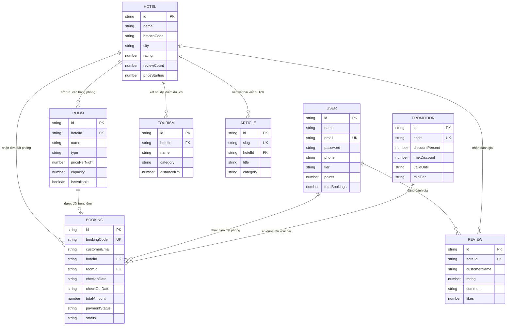

# BẢO TÀI LIỆU THIẾT KẾ CƠ SỞ DỮ LIỆU - AURA RESORT & VĂN HOÁ DU LỊCH
> **Hệ thống:** Aura Resort - Đặt Phòng & Du Lịch Văn Hoá  
> **Cơ sở dữ liệu:** MongoDB / Mongoose ODM & In-Memory Resilient Store  
> **Database Name:** `hotel_booking`  
> **Phiên bản:** 1.0  
> **Ngày cập nhật:** 13/09/2026  

---

## I. TỔNG QUAN KIẾN TRÚC CƠ SỞ DỮ LIỆU

Hệ thống cơ sở dữ liệu Aura Resort được thiết kế theo kiến trúc **Dual-Storage (Kiến trúc lưu trữ kép)**:
1. **Lớp CSDL Chính (MongoDB / Mongoose):** Kết nối qua URI cấu hình `MONGODB_URI` (mặc định: `mongodb://localhost:27017/hotel_booking`).
2. **Lớp Dự Phòng & Bộ Nhớ Tạm (Resilient In-Memory & Seed Data):** Tự động kích hoạt khi MongoDB chưa sẵn sàng, đảm bảo ứng dụng backend không bao giờ bị dừng (crash) và luôn phục vụ API mượt mà.

Cơ sở dữ liệu bao gồm **8 Bảng dữ liệu chính (Collections)**:
- `users`: Quản lý người dùng, hội viên Aura Loyalty Club.
- `bookings`: Quản lý đơn đặt phòng và lịch sử giao dịch.
- `hotels`: Quản lý danh sách các khu nghỉ dưỡng / khách sạn.
- `rooms`: Quản lý chi tiết các hạng phòng nghỉ.
- `reviews`: Quản lý đánh giá và bình luận từ khách hàng.
- `promotions`: Quản lý mã giảm giá và voucher ưu đãi.
- `tourisms`: Quản lý điểm du lịch văn hóa & trải nghiệm địa phương.
- `articles`: Quản lý bài viết cẩm nang du lịch & tin tức văn hóa.

---

## II. SƠ ĐỒ MỐI QUAN HỆ THỰC THỂ (ERD - MERMAID)

---

## III. CHI TIẾT CÁC BẢNG DỮ LIỆU (DATABASE TABLES SCHEMA)

### 1. Bảng `users` (Quản Lý Hội Viên & Người Dùng)
* **File Model:** [`backend/models/user.model.js`](file:///c:/Users/huyphong/Downloads/auraresort---đặt-phòng-&-du-lịch-văn-hoá/backend/models/user.model.js)
* **Mô tả:** Lưu trữ thông tin tài khoản người dùng, hạng thẻ hội viên Aura Loyalty Club (Bronze, Silver, Gold, Diamond), điểm thưởng tích lũy, đặc quyền hội viên và danh sách thông báo.

| Tên trường | Kiểu dữ liệu | Ràng buộc | Giá trị mặc định | Mô tả chi tiết |
| :--- | :--- | :--- | :--- | :--- |
| `_id` | ObjectId | Primary Key | Auto | Khóa chính MongoDB |
| `id` | String | Required, Unique | `user-[timestamp]` | Mã định danh duy nhất của người dùng |
| `name` | String | Required | — | Họ và tên người dùng |
| `email` | String | Required, Unique | — | Địa chỉ email (dùng để đăng nhập) |
| `password` | String | Required | — | Mật khẩu (đã mã hóa) |
| `phone` | String | Optional | `""` | Số điện thoại liên hệ |
| `tier` | String | Optional | `'Bronze'` | Hạng thẻ hội viên (`Bronze`, `Silver`, `Gold`, `Diamond`) |
| `points` | String/Number | Optional | `500` | Số điểm thưởng tích lũy hiện tại |
| `pointsToNextTier` | Number | Optional | `2500` | Số điểm cần thêm để thăng hạng |
| `nextTier` | String | Optional | `'Silver'` | Tên hạng thẻ kế tiếp |
| `memberSince` | String | Optional | Ngày hiện tại (`YYYY-MM-DD`) | Ngày gia nhập câu lạc bộ hội viên |
| `totalBookings` | Number | Optional | `0` | Tổng số lượt đặt phòng đã hoàn tất |
| `benefits` | Array[String] | Optional | `[...]` | Danh sách quyền lợi tương ứng với hạng thẻ |
| `notifications` | Array[Object] | Optional | `[...]` | Danh sách thông báo cá nhân (gồm id, title, content, time, read, type) |
| `createdAt` | Date | Auto | Date.now() | Thời gian tạo tài khoản |
| `updatedAt` | Date | Auto | Date.now() | Thời gian cập nhật gần nhất |

---

### 2. Bảng `bookings` (Quản Lý Đơn Đặt Phòng)
* **File Model:** [`backend/models/booking.model.js`](file:///c:/Users/huyphong/Downloads/auraresort---đặt-phòng-&-du-lịch-văn-hoá/backend/models/booking.model.js)
* **Mô tả:** Lưu vết toàn bộ giao dịch đặt phòng, thông tin khách hàng, số đêm lưu trú, chiết khấu voucher, phương thức thanh toán và trạng thái đặt phòng.

| Tên trường | Kiểu dữ liệu | Ràng buộc | Giá trị mặc định | Mô tả chi tiết |
| :--- | :--- | :--- | :--- | :--- |
| `_id` | ObjectId | Primary Key | Auto | Khóa chính MongoDB |
| `id` | String | Required, Unique | `book-[timestamp]` | Mã định danh đơn đặt phòng |
| `bookingCode` | String | Required, Unique | `AURA-BK-XXXX` | Mã tra cứu đơn hàng hiển thị cho khách |
| `customerName` | String | Required | — | Họ tên người đặt phòng |
| `customerEmail` | String | Required | — | Email người đặt phòng |
| `customerPhone` | String | Required | — | Số điện thoại người đặt |
| `hotelId` | String | Required, FK | — | ID khu nghỉ dưỡng (`hotels.id`) |
| `hotelName` | String | Required | — | Tên resort tại thời điểm đặt |
| `roomId` | String | Required, FK | — | ID hạng phòng (`rooms.id`) |
| `roomName` | String | Required | — | Tên hạng phòng |
| `checkInDate` | String | Required | — | Ngày nhận phòng (`YYYY-MM-DD`) |
| `checkOutDate` | String | Required | — | Ngày trả phòng (`YYYY-MM-DD`) |
| `nights` | Number | Optional | `1` | Tổng số đêm lưu trú |
| `guests` | Number | Optional | `2` | Số lượng khách ở |
| `roomPrice` | Number | Required | — | Giá gốc phòng theo đêm (VND) |
| `discountAmount` | Number | Optional | `0` | Số tiền giảm giá được trừ (VND) |
| `voucherApplied` | String | Optional | `null` | Mã voucher / promotion đã sử dụng |
| `totalAmount` | Number | Required | — | Tổng tiền thanh toán thực tế (VND) |
| `paymentStatus` | String | Enum | `'paid'` | Trạng thái thanh toán (`pending`, `paid`, `refunded`, `cancelled`) |
| `paymentMethod` | String | Enum | `'vnpay'` | Phương thức thanh toán (`vnpay`, `momo`, `card`, `vietqr`, `at_hotel`) |
| `specialRequests` | String | Optional | `""` | Yêu cầu đặc biệt của khách hàng |
| `loyaltyPointsEarned` | Number | Optional | `0` | Số điểm thưởng tích lũy nhận được từ đơn |
| `status` | String | Enum | `'confirmed'` | Trạng thái đơn (`confirmed`, `completed`, `cancelled`) |
| `createdAt` | Date | Auto | Date.now() | Thời gian khởi tạo đơn |

---

### 3. Bảng `hotels` (Quản Lý Khu Nghỉ Dưỡng & Khách Sạn)
* **File Model:** [`backend/models/hotel.model.js`](file:///c:/Users/huyphong/Downloads/auraresort---đặt-phòng-&-du-lịch-văn-hoá/backend/models/hotel.model.js)
* **Mô tả:** Thông tin các chi nhánh Resort (Đà Nẵng, Sa Pa, Phú Quốc, Huế...), địa chỉ, vị trí GPS, giá khởi điểm và tiện ích nổi bật.

| Tên trường | Kiểu dữ liệu | Ràng buộc | Giá trị mặc định | Mô tả chi tiết |
| :--- | :--- | :--- | :--- | :--- |
| `_id` | ObjectId | Primary Key | Auto | Khóa chính MongoDB |
| `id` | String | Required, Unique | `hotel-[slug]` | Mã định danh duy nhất của Resort |
| `name` | String | Required | — | Tên đầy đủ khu nghỉ dưỡng |
| `branchCode` | String | Required | — | Mã chi nhánh (VD: `AURA-DAD`, `AURA-SP`) |
| `city` | String | Required | — | Thành phố / Tỉnh |
| `address` | String | Required | — | Địa chỉ chi tiết |
| `tagline` | String | Optional | — | Khẩu hiệu / Thông điệp thương hiệu |
| `rating` | Number | Optional | `5.0` | Điểm đánh giá trung bình (1.0 - 5.0) |
| `reviewCount` | Number | Optional | `0` | Tổng số lượt đánh giá |
| `coordinates` | Object | Required | `{lat, lng}` | Tọa độ địa lý GPS (Vĩ độ & Kinh độ) |
| `coverImage` | String | Required | — | URL hình ảnh đại diện chính |
| `galleryImages` | Array[String] | Optional | `[]` | Danh sách URL bộ sưu tập ảnh |
| `priceStarting` | Number | Required | — | Giá phòng khởi điểm thấp nhất (VND) |
| `description` | String | Required | — | Bài giới thiệu chi tiết resort |
| `amenities` | Array[String] | Optional | `[]` | Danh sách dịch vụ & tiện ích nổi bật |
| `phone` | String | Optional | — | Số điện thoại hotline chi nhánh |
| `email` | String | Optional | — | Email tiếp nhận thông tin chi nhánh |

---

### 4. Bảng `rooms` (Quản Lý Hạng Phòng)
* **File Model:** [`backend/models/room.model.js`](file:///c:/Users/huyphong/Downloads/auraresort---đặt-phòng-&-du-lịch-văn-hoá/backend/models/room.model.js)
* **Mô tả:** Chi tiết về các loại phòng nghỉ tại từng resort (Deluxe, Suite, Villa), diện tích, sức chứa, giá tiền và tiện nghi đi kèm.

| Tên trường | Kiểu dữ liệu | Ràng buộc | Giá trị mặc định | Mô tả chi tiết |
| :--- | :--- | :--- | :--- | :--- |
| `_id` | ObjectId | Primary Key | Auto | Khóa chính MongoDB |
| `id` | String | Required, Unique | `room-[code]` | Mã phòng duy nhất |
| `hotelId` | String | Required, FK | — | ID resort sở hữu phòng (`hotels.id`) |
| `name` | String | Required | — | Tên hạng phòng |
| `type` | String | Required | — | Loại phòng (`deluxe`, `suite`, `villa`, `executive`) |
| `pricePerNight` | Number | Required | — | Giá thuê theo đêm (VND) |
| `capacity` | Number | Required | — | Sức chứa tối đa (người) |
| `bedType` | String | Required | — | Loại giường (King, Queen, Twin...) |
| `areaSqm` | Number | Required | — | Diện tích phòng ($m^2$) |
| `view` | String | Required | — | Hướng nhìn (View biển, Thung lũng, Sân vườn...) |
| `images` | Array[String] | Optional | `[]` | Danh sách ảnh phòng |
| `amenities` | Array[String] | Optional | `[]` | Tiện nghi trong phòng (Bồn tắm, Balcony, Minibar...) |
| `isAvailable` | Boolean | Optional | `true` | Trạng thái phòng khả dụng hay đã kín |

---

### 5. Bảng `reviews` (Quản Lý Đánh Giá & Phản Hồi)
* **File Model:** [`backend/models/review.model.js`](file:///c:/Users/huyphong/Downloads/auraresort---đặt-phòng-&-du-lịch-văn-hoá/backend/models/review.model.js)
* **Mô tả:** Lưu trữ bài đánh giá của khách hàng đối với từng khu nghỉ dưỡng, bao gồm điểm đánh giá tổng thể và điểm thành phần.

| Tên trường | Kiểu dữ liệu | Ràng buộc | Giá trị mặc định | Mô tả chi tiết |
| :--- | :--- | :--- | :--- | :--- |
| `_id` | ObjectId | Primary Key | Auto | Khóa chính MongoDB |
| `id` | String | Required, Unique | `rev-[timestamp]` | Mã đánh giá duy nhất |
| `hotelId` | String | Required, FK | — | ID resort được đánh giá (`hotels.id`) |
| `customerName` | String | Required | — | Tên khách hàng đánh giá |
| `customerAvatar` | String | Optional | — | URL ảnh đại diện |
| `rating` | Number | Required (1-5) | — | Điểm đánh giá tổng thể |
| `cleanRating` | Number | Optional | `5` | Điểm độ sạch sẽ |
| `serviceRating` | Number | Optional | `5` | Điểm chất lượng dịch vụ |
| `locationRating` | Number | Optional | `5` | Điểm vị trí & cảnh quan |
| `comment` | String | Required | — | Nội dung nhận xét chi tiết |
| `roomType` | String | Optional | — | Hạng phòng đã trải nghiệm |
| `verifiedBooking` | Boolean | Optional | `true` | Xác thực đã từng đặt phòng thành công |
| `likes` | Number | Optional | `0` | Số lượt bấm hữu ích / thích nhận xét |
| `createdAt` | String | Optional | Ngày hiện tại (`YYYY-MM-DD`) | Ngày viết đánh giá |

---

### 6. Bảng `promotions` (Quản Lý Mã Giảm Giá & Ưu Đãi)
* **File Model:** [`backend/models/promotion.model.js`](file:///c:/Users/huyphong/Downloads/auraresort---đặt-phòng-&-du-lịch-văn-hoá/backend/models/promotion.model.js)
* **Mô tả:** Lưu thông tin các chương trình khuyến mãi, mã voucher giảm giá khi đặt phòng trực tuyến.

| Tên trường | Kiểu dữ liệu | Ràng buộc | Giá trị mặc định | Mô tả chi tiết |
| :--- | :--- | :--- | :--- | :--- |
| `_id` | ObjectId | Primary Key | Auto | Khóa chính MongoDB |
| `id` | String | Required, Unique | `promo-[code]` | Mã định danh chương trình |
| `title` | String | Required | — | Tên chương trình ưu đãi |
| `code` | String | Required, Unique | — | Mã nhập giảm giá (Ví dụ: `AURA15`, `VIPGOLD25`) |
| `discountPercent` | Number | Required | — | Phần trăm chiết khấu (% giảm) |
| `maxDiscount` | Number | Optional | `2000000` | Số tiền giảm tối đa (VND) |
| `description` | String | Required | — | Mô tả điều kiện áp dụng |
| `validUntil` | String | Required | — | Ngày hết hạn (`YYYY-MM-DD`) |
| `minTier` | String | Optional | `'Bronze'` | Hạng hội viên tối thiểu được dùng |
| `category` | String | Optional | — | Phân loại ưu đãi |
| `badge` | String | Optional | — | Nhãn hiển thị (VD: HOT, LIMITED) |
| `bannerImage` | String | Optional | — | Ảnh banner quảng bá |

---

### 7. Bảng `tourisms` (Địa Điểm Du Lịch Văn Hoá)
* **File Model:** [`backend/models/tourism.model.js`](file:///c:/Users/huyphong/Downloads/auraresort---đặt-phòng-&-du-lịch-văn-hoá/backend/models/tourism.model.js)
* **Mô tả:** Danh mục địa điểm tham quan, di tích lịch sử, làng nghề truyền thống và danh thắng xung quanh các khu nghỉ dưỡng Aura.

| Tên trường | Kiểu dữ liệu | Ràng buộc | Giá trị mặc định | Mô tả chi tiết |
| :--- | :--- | :--- | :--- | :--- |
| `_id` | ObjectId | Primary Key | Auto | Khóa chính MongoDB |
| `id` | String | Required, Unique | `tour-[slug]` | Mã định danh điểm du lịch |
| `hotelId` | String | Required, FK | — | ID resort liên kết gần nhất (`hotels.id`) |
| `name` | String | Required | — | Tên địa danh du lịch |
| `category` | String | Required | — | Danh mục (`Di sản`, `Văn hóa`, `Thiên nhiên`, `Ẩm thực`) |
| `distanceKm` | Number | Required | — | Khoảng cách từ resort tới điểm du lịch (km) |
| `description` | String | Required | — | Tóm tắt trải nghiệm tại điểm du lịch |
| `highlight` | String | Optional | — | Điểm đặc sắc nổi bật nhất |
| `image` | String | Required | — | URL ảnh minh họa địa điểm |
| `coordinates` | Object | Required | `{lat, lng}` | Tọa độ địa lý GPS |
| `culturalSignificance` | String | Optional | — | Ý nghĩa lịch sử - văn hóa địa phương |
| `bestTimeToVisit` | String | Optional | — | Khoảng thời gian ghé thăm lý tưởng nhất |
| `suggestedDuration` | String | Optional | — | Thời gian tham quan gợi ý |

---

### 8. Bảng `articles` (Bài Viết & Cẩm Nang Du Lịch)
* **File Model:** [`backend/models/article.model.js`](file:///c:/Users/huyphong/Downloads/auraresort---đặt-phòng-&-du-lịch-văn-hoá/backend/models/article.model.js)
* **Mô tả:** Quản lý các bài viết góc nhìn văn hóa, kinh nghiệm du lịch, ẩm thực địa phương đăng trên website.

| Tên trường | Kiểu dữ liệu | Ràng buộc | Giá trị mặc định | Mô tả chi tiết |
| :--- | :--- | :--- | :--- | :--- |
| `_id` | ObjectId | Primary Key | Auto | Khóa chính MongoDB |
| `id` | String | Required, Unique | `art-[slug]` | Mã định danh bài viết |
| `title` | String | Required | — | Tiêu đề bài viết |
| `slug` | String | Required, Unique | — | Đường dẫn URL thân thiện SEO |
| `hotelId` | String | Optional, FK | — | ID resort liên quan (nếu có) |
| `location` | String | Optional | — | Địa danh liên quan |
| `category` | String | Optional | — | Chuyên mục bài viết |
| `readTime` | String | Optional | — | Thời lượng đọc dự kiến (VD: "5 phút") |
| `publishedDate` | String | Optional | — | Ngày xuất bản |
| `author` | Object | Optional | `{name, role, avatar}` | Thông tin tác giả bài viết |
| `coverImage` | String | Required | — | Ảnh bìa bài viết |
| `excerpt` | String | Required | — | Đoạn trích dẫn ngắn |
| `content` | String | Required | — | Nội dung chi tiết bài viết (Markdown/HTML) |

---

## IV. VỊ TRÍ FILE VÀ NGUỒN DỮ LIỆU TRONG CODEBASE

1. **Thư mục Models:** [`backend/models/`](file:///c:/Users/huyphong/Downloads/auraresort---đặt-phòng-&-du-lịch-văn-hoá/backend/models/)
2. **File Cấu hình CSDL:** [`backend/config/db.js`](file:///c:/Users/huyphong/Downloads/auraresort---đặt-phòng-&-du-lịch-văn-hoá/backend/config/db.js)
3. **File Seed Data gốc:** [`backend/data/seedData.js`](file:///c:/Users/huyphong/Downloads/auraresort---đặt-phòng-&-du-lịch-văn-hoá/backend/data/seedData.js)
4. **Định nghĩa Type Client (TypeScript):** [`client/src/types/index.ts`](file:///c:/Users/huyphong/Downloads/auraresort---đặt-phòng-&-du-lịch-văn-hoá/client/src/types/index.ts)
